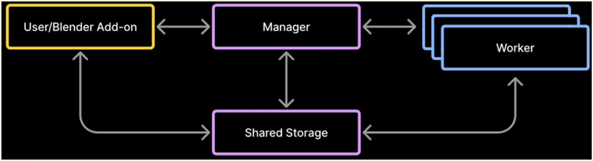
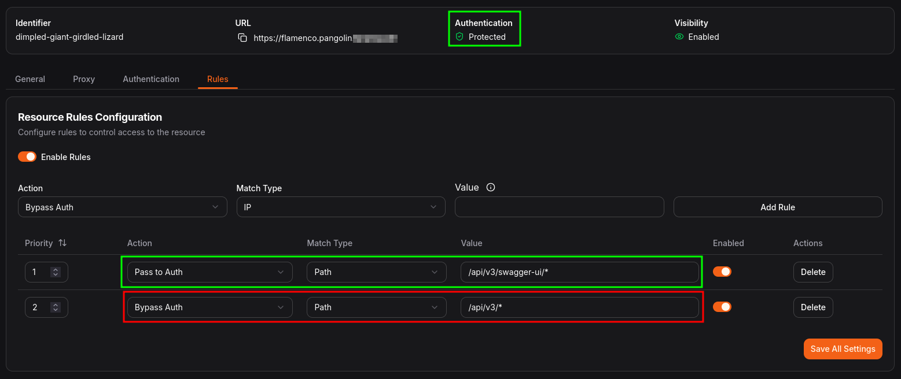
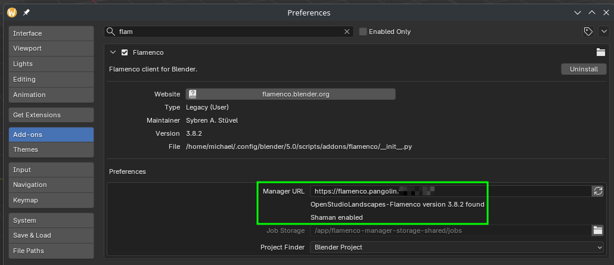

[](https://github.com/michimussato/OpenStudioLandscapes)

***

1. [Feature: OpenStudioLandscapes-Flamenco](#feature-openstudiolandscapes-flamenco)
   1. [Brief](#brief)
   2. [Clone](#clone)
      1. [Clone and Install](#clone-and-install)
      2. [Uninstall](#uninstall)
   3. [Configure](#configure)
      1. [Default Configuration](#default-configuration)
   4. [Local Development/Unit Testing/Debugging](#local-developmentunit-testingdebugging)
2. [External Resources](#external-resources)
   1. [Quickstart](#quickstart)
   2. [Topology](#topology)
   3. [API](#api)
      1. [Pangolin](#pangolin)
   4. [Help](#help)
      1. [Manager](#manager)
      2. [Worker](#worker)
3. [Community](#community)

***

This `README.md` was dynamically created with [OpenStudioLandscapesUtil-ReadmeGenerator](https://github.com/michimussato/OpenStudioLandscapesUtil-ReadmeGenerator).

***

# Feature: OpenStudioLandscapes-Flamenco

## Brief

This is an extension to the OpenStudioLandscapes ecosystem. The full documentation of OpenStudioLandscapes is available [here](https://github.com/michimussato/OpenStudioLandscapes).

> [!NOTE]
> 
> You feel like writing your own Feature? Go and check out the 
> [OpenStudioLandscapes-Template](https://github.com/michimussato/OpenStudioLandscapes-Template).

## Clone

Clone this repository into `OpenStudioLandscapes/.features` (assuming the current working directory to be the Git repository root `./OpenStudioLandscapes`):

```shell
# cd OpenStudioLandscapes
source .venv/bin/activate
openstudiolandscapes clone-feature --repo=https://github.com/michimussato/OpenStudioLandscapes-Flamenco.git
deactivate
# Check the resulting console output for installation instructions
```

If Feature repository was cloned locally already:

```shell
# cd OpenStudioLandscapes
source .venv/bin/activate
pip install --editable ./.features/<Feature>
deactivate
# Check the resulting console output for installation instructions
```

### Clone and Install

```shell
# cd OpenStudioLandscapes
source .venv/bin/activate
openstudiolandscapes clone-feature --repo=https://github.com/michimussato/OpenStudioLandscapes-Flamenco.git --install
deactivate
```

### Uninstall

```shell
# cd OpenStudioLandscapes
source .venv/bin/activate
pip uninstall OpenStudioLandscapes-Flamenco
deactivate
```

For more info on `pip` see [VCS Support of `pip`](https://pip.pypa.io/en/stable/topics/vcs-support/).

## Configure

OpenStudioLandscapes will search for a local config store. The default location is `~/.config/OpenStudioLandscapes/config-store/` but you can specify a different location if you need to.

> [!TIP]
> 
> To specify a config store location different from
> the default location, check out the OpenStudioLandscapes 
> [CLI Section](https://github.com/michimussato/OpenStudioLandscapes#cli)
> to find out how to do that.

A local config store location will be created if it doesn't exist, together with the `config.yml` files for each individual Feature.

> [!TIP]
> 
> The config store root will be initialized as a local Git
> controlled repository. This makes it easy to track changes
> you made to the `config.yml`.

The following settings are available in `OpenStudioLandscapes-Flamenco` and are based on [`OpenStudioLandscapes-Flamenco/tree/main/src/OpenStudioLandscapes/Flamenco/config/models.py`](https://github.com/michimussato/OpenStudioLandscapes-Flamenco/tree/main/src/OpenStudioLandscapes/Flamenco/config/models.py).

### Default Configuration

<details open>
<summary><code>config.yml</code></summary>


```yaml
compose_scope:
  default: default
  examples:
  - default
  - license_server
  - worker
  title: Compose Scope
  type: string
docker_compose:
  default: '{DOT_LANDSCAPES}/{LANDSCAPE}/{FEATURE}/docker_compose/docker-compose.yml'
  description: The path to the `docker-compose.yml` file.
  format: path
  title: Docker Compose
  type: string
enabled:
  default: true
  description: Whether the Feature is enabled or not.
  title: Enabled
  type: boolean
env:
  additionalProperties: true
  title: Env
  type: object
feature_name:
  default: OpenStudioLandscapes-Flamenco
  title: Feature Name
  type: string
flamenco_manager_port_container:
  default: 8080
  exclusiveMinimum: 0
  title: Flamenco Manager Port Container
  type: integer
flamenco_manager_port_host:
  default: 8484
  exclusiveMinimum: 0
  title: Flamenco Manager Port Host
  type: integer
flamenco_manager_yaml:
  additionalProperties: true
  default:
    _meta:
      version: 3
    autodiscoverable: true
    blocklist_threshold: 3
    database: /app/flamenco-manager-storage/flamenco-manager.sqlite
    database_check_period: 10m0s
    listen: :8080
    local_manager_storage_path: /app/flamenco-manager-storage
    manager_name: OpenStudioLandscapes-Flamenco
    mqtt:
      client:
        broker: ''
        clientID: flamenco
        password: ''
        topic_prefix: flamenco
        username: ''
    shaman:
      enabled: true
      garbageCollect:
        extraCheckoutPaths: []
        maxAge: 744h0m0s
        period: 24h0m0s
    shared_storage_path: /app/flamenco-manager-storage-shared
    task_fail_after_softfail_count: 3
    task_timeout: 10m0s
    variables:
      blender:
        values:
        - audience: all
          platform: linux
          value: blender
        - audience: all
          platform: windows
          value: blender.exe
        - audience: all
          platform: darwin
          value: blender
      blenderArgs:
        values:
        - audience: all
          platform: all
          value: "--background --debug --enable-autoexec --python-expr 'import enum\n\
            from typing import List\nimport logging\n\nimport bpy\n\nlogging.basicConfig(\n\
            \    level=logging.INFO,\n    format='\"'\"'%(asctime)-15s %(levelname)8s\
            \ : %(message)s'\"'\"'\n)\n\nlog = logging.getLogger(\"enable_gpu_in_blender_pref\"\
            )\n\n\nclass DeviceType(enum.StrEnum):\n    CUDA = \"CUDA\"\n    OPTIX\
            \ = \"OPTIX\"\n\n\n# Todo\nclass Backend(enum.StrEnum):\n    OPENCL =\
            \ \"OPENCL\"\n    VULKAN = \"VULKAN\"\n\n\n# References:\n# - [Rendering\
            \ on command-line with GPU?](https://blender.stackexchange.com/a/256665/152092)\n\
            \ndef enable_gpus(\n        device_type: DeviceType,\n        use_cpus:\
            \ bool = False,\n) -> List[str]:\n\n    log.warning(f\"Trying to enable\
            \ GPUs in Blender Preferences: {device_type}\")\n    log.warning(f\"Trying\
            \ to enable CPU in Blender Preferences: {use_cpus}\")\n\n    preferences\
            \ = bpy.context.preferences\n    cycles_preferences = preferences.addons[\"\
            cycles\"].preferences\n    cycles_preferences.refresh_devices()\n    devices\
            \ = cycles_preferences.devices\n\n    if not devices:\n        raise RuntimeError(\"\
            Unsupported device type\")\n\n    activated_gpus = []\n\n    for device\
            \ in devices:\n        if device.type == \"CPU\":\n            device.use\
            \ = use_cpus\n        else:\n            device.use = True\n         \
            \   activated_gpus.append(device.name)\n\n        log.warning(f\"{device.name}\
            \ [{list(devices).index(device)}] enabled: {device.use}\")\n\n    cycles_preferences.compute_device_type\
            \ = device_type\n    bpy.context.scene.cycles.device = \"GPU\"\n\n   \
            \ log.info(f\"Activated GPUs: {activated_gpus}\")\n\n    return activated_gpus\n\
            \n\nenable_gpus(\n    device_type=DeviceType.OPTIX,\n    use_cpus=True,\n\
            )\n'"
    worker_timeout: 1m0s
  description: The flamenco-manager.yaml. See https://flamenco.blender.org/usage/manager-configuration/
    for more information.
  title: Flamenco Manager Yaml
  type: object
flamenco_shared_storage:
  default: '{DOT_LANDSCAPES}/{LANDSCAPE}/{FEATURE}/shared_storage'
  format: path
  title: Flamenco Shared Storage
  type: string
flamenco_storage:
  default: '{DOT_LANDSCAPES}/{LANDSCAPE}/{FEATURE}/storage'
  format: path
  title: Flamenco Storage
  type: string
flamenco_version:
  $ref: '#/$defs/FlamencoArchives'
  default: https://flamenco.blender.org/downloads/flamenco-3.9.2-linux-amd64.tar.gz
  examples:
  - version_3_7
  - version_3_8
  - version_3_8_2
  - version_3_8_5
  - version_3_9_2
group_name:
  default: OpenStudioLandscapes_Flamenco
  title: Group Name
  type: string
key_prefixes:
  default:
  - OpenStudioLandscapes_Flamenco
  items:
    type: string
  title: Key Prefixes
  type: array
local_bind_volumes:
  description: Here you can define Feature specific, arbitrary, absolute bind volume
    mappings.
  items:
    type: string
  title: Local Bind Volumes
  type: array
local_environment_variables:
  additionalProperties:
    type: string
  description: Here you can define Feature specific, arbitrary environment variables.
  title: Local Environment Variables
  type: object
nvidia_container_toolkit_version:
  $ref: '#/$defs/NvidiaContainerToolkit'
  default: 1.19.1-1
  description: '

    https://docs.nvidia.com/datacenter/cloud-native/container-toolkit/latest/install-guide.html

    '
  examples:
  - version_1_19_1__1

```

</details>


## Local Development/Unit Testing/Debugging

This is for isolated development, unit testing and debugging. Instead of the [`OpenStudioLandscapes-Flamenco/tree/main/src/OpenStudioLandscapes/Flamenco/definitions.py`](https://github.com/michimussato/OpenStudioLandscapes-Flamenco/tree/main/src/OpenStudioLandscapes/Flamenco/definitions.py), the accompanying [`OpenStudioLandscapes-Flamenco/tree/main/workspace.yaml`](https://github.com/michimussato/OpenStudioLandscapes-Flamenco/tree/main/workspace.yaml) loads the [`OpenStudioLandscapes-Flamenco/tree/main/src/OpenStudioLandscapes/Flamenco/_definitions_with_upstream_specs.py`](https://github.com/michimussato/OpenStudioLandscapes-Flamenco/tree/main/src/OpenStudioLandscapes/Flamenco/_definitions_with_upstream_specs.py) which also contains [`AssetSpec`](https://release-1-9-13.archive.dagster-docs.io/api/dagster/assets#dagster.AssetSpec) definitions for upstream dependencies as [external assets](https://release-1-9-13.archive.dagster-docs.io/guides/build/assets/external-assets).

```shell
# cd ./.features/OpenStudioLandscapes-Flamenco
python3.11 -m venv .venv
source .venv/bin/activate
pip install --upgrade pip setuptools setuptools_scm wheel
pip install --editable .[dev]
dagster dev --workspace workspace.yaml
```

***

# External Resources

[](https://flamenco.blender.org/)

Official Flamenco information.

- [Flamenco Chat](https://chat.blender.org/#/room/#flamenco:blender.org)
- [Flamenco Codebase](https://projects.blender.org/studio/flamenco)

## Quickstart

- [Quickstart](https://flamenco.blender.org/usage/quickstart/)

## Topology



Source:

- [Blender Studio - Installing Flamenco in 5 minutes](https://www.youtube.com/watch?v=O728EFaXuBk)

## API

A Swagger UI is running at `/api/v3/swagger-ui/`.

### Pangolin

To bypass Pangolin protection for the API endpoint (`/api/v3/`) you can use this as an example:





## Help

Remember to add flamenco-manager FQDN to your local DNS server for the worker to be able to find it by.

### Manager

```generic
./flamenco-manager --help                                                                                                                                                                                                              ✔ 
2025-10-29T13:04:02+01:00 INF starting Flamenco arch=amd64 git=72c1bad4 os=linux osDetail="Manjaro Linux (6.16.8-1-MANJARO)" releaseCycle=release version=3.7
Usage of ./flamenco-manager:
  -debug
        Enable debug-level logging.
  -delay
        Add a random delay to any HTTP responses. This aids in development of Flamenco Manager's web frontend.
  -pprof
        Expose profiler endpoints on /debug/pprof/.
  -quiet
        Only log warning-level and worse.
  -setup-assistant
        Open a webbrowser with the setup assistant.
  -trace
        Enable trace-level logging.
  -version
        Shows the application version, then exits.
  -write-config
        Writes configuration to flamenco-manager.yaml, then exits.
```

- [Manager Configuration](https://flamenco.blender.org/usage/manager-configuration/)

### Worker

```generic
./flamenco-worker --help                                                                                                                                                                                                               ✔ 
Usage of ./flamenco-worker:
  -debug
        Enable debug-level logging.
  -find-manager
        Autodiscover a Manager, then quit.
  -flush
        Flush any buffered task updates to the Manager, then exits.
  -manager string
        URL of the Flamenco Manager.
  -quiet
        Only log warning-level and worse.
  -register
        (Re-)register at the Manager.
  -restart-exit-code int
        Mark this Worker as restartable. It will exit with this code to signify it needs to be restarted.
  -trace
        Enable trace-level logging.
  -version
        Shows the application version, then exits.
```

- [Worker Configuration](https://flamenco.blender.org/usage/worker-configuration/)

```generic
./flamenco-worker -manager flamenco-manager.openstudiolandscapes.lan:8484                                                                                                                                                              ✔ 
2025-10-29T15:30:42+01:00 INF starting Flamenco Worker arch=amd64 git=72c1bad4 os=linux osDetail="Manjaro Linux (6.16.8-1-MANJARO)" pid=625742 releaseCycle=release version=3.7
2025-10-29T15:30:42+01:00 INF will load configuration from these paths credentials=/home/michael/.local/share/flamenco/flamenco-worker-credentials.yaml main=/home/michael/Downloads/flamenco-3.7-linux-amd64/flamenco-worker.yaml
2025-10-29T15:30:42+01:00 INF using Manager URL from commandline manager=http://flamenco-manager.openstudiolandscapes.lan:8484
2025-10-29T15:30:42+01:00 INF Blender could not be found. Flamenco Manager will have to supply the full path to Blender when tasks are sent to this Worker. For more info see https://flamenco.blender.org/usage/variables/blender/
2025-10-29T15:30:42+01:00 INF FFmpeg found on this system path=/home/michael/Downloads/flamenco-3.7-linux-amd64/tools/ffmpeg-linux-amd64 version=7.0.2-static
2025-10-29T15:30:42+01:00 INF loaded configuration config={"ConfiguredManager":"","LinuxOOMScoreAdjust":null,"ManagerURL":"http://flamenco-manager.openstudiolandscapes.lan:8484","RestartExitCode":0,"TaskTypes":["blender","ffmpeg","file-management","misc"],"WorkerName":""}
2025-10-29T15:30:42+01:00 INF loaded credentials filename=/home/michael/.local/share/flamenco/flamenco-worker-credentials.yaml
2025-10-29T15:30:42+01:00 INF signing on at Manager manager=http://flamenco-manager.openstudiolandscapes.lan:8484 name=lenovo softwareVersion=3.7 taskTypes=["blender","ffmpeg","file-management","misc"]
2025-10-29T15:30:42+01:00 WRN unable to sign on at Manager code=403 resp={"code":0,"message":"Security requirements failed"}
2025-10-29T15:30:42+01:00 INF registered at Manager code=200 resp={"address":"192.168.178.195","name":"lenovo","platform":"linux","software":"","status":"","supported_task_types":["blender","ffmpeg","file-management","misc"],"uuid":"73f5de82-a3aa-4f93-ab88-b3adf0be35d6"}
2025-10-29T15:30:42+01:00 INF Saved configuration file filename=/home/michael/.local/share/flamenco/flamenco-worker-credentials.yaml
2025-10-29T15:30:42+01:00 INF signing on at Manager manager=http://flamenco-manager.openstudiolandscapes.lan:8484 name=lenovo softwareVersion=3.7 taskTypes=["blender","ffmpeg","file-management","misc"]
2025-10-29T15:30:42+01:00 INF manager accepted sign-on startup_state=awake
2025-10-29T15:30:42+01:00 INF opening database dsn=/home/michael/.local/share/flamenco/flamenco-worker.sqlite
2025-10-29T15:30:42+01:00 INF state change curState=starting newState=awake
^C2025-10-29T15:30:49+01:00 INF signal received, shutting down. signal=interrupt
2025-10-29T15:30:49+01:00 INF signing off at Manager state=offline
2025-10-29T15:30:49+01:00 WRN shutdown complete, stopping process.
```

***

# Community

| Feature                                   | GitHub                                                                                                                                                 | Discord                                                                      |
| ----------------------------------------- | ------------------------------------------------------------------------------------------------------------------------------------------------------ | ---------------------------------------------------------------------------- |
| OpenStudioLandscapes                      | [https://github.com/michimussato/OpenStudioLandscapes](https://github.com/michimussato/OpenStudioLandscapes)                                           | [# openstudiolandscapes-general](https://discord.gg/F6bDRWsHac)              |
| OpenStudioLandscapes-Ayon                 | [https://github.com/michimussato/OpenStudioLandscapes-Ayon](https://github.com/michimussato/OpenStudioLandscapes-Ayon)                                 | [# openstudiolandscapes-ayon](https://discord.gg/gd6etWAF3v)                 |
| OpenStudioLandscapes-Dagster              | [https://github.com/michimussato/OpenStudioLandscapes-Dagster](https://github.com/michimussato/OpenStudioLandscapes-Dagster)                           | [# openstudiolandscapes-dagster](https://discord.gg/jwB3DwmKvs)              |
| OpenStudioLandscapes-Deadline-10-2        | [https://github.com/michimussato/OpenStudioLandscapes-Deadline-10-2](https://github.com/michimussato/OpenStudioLandscapes-Deadline-10-2)               | [# openstudiolandscapes-deadline-10-2](https://discord.gg/p2UjxHk4Y3)        |
| OpenStudioLandscapes-Deadline-10-2-Worker | [https://github.com/michimussato/OpenStudioLandscapes-Deadline-10-2-Worker](https://github.com/michimussato/OpenStudioLandscapes-Deadline-10-2-Worker) | [# openstudiolandscapes-deadline-10-2-worker](https://discord.gg/ttkbfkzUmf) |
| OpenStudioLandscapes-Flamenco             | [https://github.com/michimussato/OpenStudioLandscapes-Flamenco](https://github.com/michimussato/OpenStudioLandscapes-Flamenco)                         | [# openstudiolandscapes-flamenco](https://discord.gg/EPrX5fzBCf)             |
| OpenStudioLandscapes-Flamenco-Worker      | [https://github.com/michimussato/OpenStudioLandscapes-Flamenco-Worker](https://github.com/michimussato/OpenStudioLandscapes-Flamenco-Worker)           | [# openstudiolandscapes-flamenco-worker](https://discord.gg/Sa2zFqSc4p)      |
| OpenStudioLandscapes-Grafana              | [https://github.com/michimussato/OpenStudioLandscapes-Grafana](https://github.com/michimussato/OpenStudioLandscapes-Grafana)                           | [# openstudiolandscapes-grafana](https://discord.gg/gEDQ8vJWDb)              |
| OpenStudioLandscapes-Kitsu                | [https://github.com/michimussato/OpenStudioLandscapes-Kitsu](https://github.com/michimussato/OpenStudioLandscapes-Kitsu)                               | [# openstudiolandscapes-kitsu](https://discord.gg/6cc6mkReJ7)                |
| OpenStudioLandscapes-LikeC4               | [https://github.com/michimussato/OpenStudioLandscapes-LikeC4](https://github.com/michimussato/OpenStudioLandscapes-LikeC4)                             | [# openstudiolandscapes-likec4](https://discord.gg/qAYYsKYF6V)               |
| OpenStudioLandscapes-OpenCue              | [https://github.com/michimussato/OpenStudioLandscapes-OpenCue](https://github.com/michimussato/OpenStudioLandscapes-OpenCue)                           | [# openstudiolandscapes-opencue](https://discord.gg/3DdCZKkVyZ)              |
| OpenStudioLandscapes-OpenCue-Worker       | [https://github.com/michimussato/OpenStudioLandscapes-OpenCue-Worker](https://github.com/michimussato/OpenStudioLandscapes-OpenCue-Worker)             | [# openstudiolandscapes-opencue-worker](https://discord.gg/n9fxxhHa3V)       |
| OpenStudioLandscapes-RustDeskServer       | [https://github.com/michimussato/OpenStudioLandscapes-RustDeskServer](https://github.com/michimussato/OpenStudioLandscapes-RustDeskServer)             | [# openstudiolandscapes-rustdeskserver](https://discord.gg/nJ8Ffd2xY3)       |
| OpenStudioLandscapes-Syncthing            | [https://github.com/michimussato/OpenStudioLandscapes-Syncthing](https://github.com/michimussato/OpenStudioLandscapes-Syncthing)                       | [# openstudiolandscapes-syncthing](https://discord.gg/upb9MCqb3X)            |
| OpenStudioLandscapes-Template             | [https://github.com/michimussato/OpenStudioLandscapes-Template](https://github.com/michimussato/OpenStudioLandscapes-Template)                         | [# openstudiolandscapes-template](https://discord.gg/J59GYp3Wpy)             |
| OpenStudioLandscapes-VERT                 | [https://github.com/michimussato/OpenStudioLandscapes-VERT](https://github.com/michimussato/OpenStudioLandscapes-VERT)                                 | [# openstudiolandscapes-vert](https://discord.gg/EPrX5fzBCf)                 |
| OpenStudioLandscapes-filebrowser          | [https://github.com/michimussato/OpenStudioLandscapes-filebrowser](https://github.com/michimussato/OpenStudioLandscapes-filebrowser)                   | [# openstudiolandscapes-filebrowser](https://discord.gg/stzNsZBmwk)          |
| OpenStudioLandscapes-n8n                  | [https://github.com/michimussato/OpenStudioLandscapes-n8n](https://github.com/michimussato/OpenStudioLandscapes-n8n)                                   | [# openstudiolandscapes-n8n](https://discord.gg/yFYrG999wE)                  |

To follow up on the previous LinkedIn publications, visit:

- [OpenStudioLandscapes on LinkedIn](https://www.linkedin.com/company/106731439/).
- [Search for tag #OpenStudioLandscapes on LinkedIn](https://www.linkedin.com/search/results/all/?keywords=%23openstudiolandscapes).

***

Last changed: **2026-07-20 07:50:43 UTC**